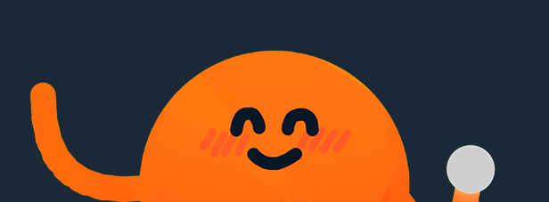

<picture>
  <!-- <source
    width="100%"
    srcset="./docs/img/banner-dark-1700x600.avif"
    media="(prefers-color-scheme: dark)"
  /> -->
  <!-- <source
    width="100%"
    srcset="./docs/img/banner-light-1700x600.avif"
    media="(prefers-color-scheme: light), (prefers-color-scheme: no-preference)"
  /> -->
  
</picture>


<h1 align="center">Rust Rounds Clone</h1>
<p align="center">
    This project is a clone of <a href="https://store.steampowered.com/app/1557740/ROUNDS/">Rounds</a> with some new features, created in Rust using the <a href="https://bevy.org/">Bevy game engine</a>. 
    The project is purely educational. The intent is simply for me to learn how to write high-performance Rust code through a real project, and hopefully results in a fun game as well.
</p>
<p align="center"> <!-- TODO: Correct badges -->
    
    
    <a href="https://bevy.org/">
        <picture>
            <source
                width="240"
                srcset="https://raw.githubusercontent.com/bevyengine/bevy/refs/heads/main/assets/branding/bevy_logo_dark.svg"
                media="(prefers-color-scheme: dark)"
            />
            <source
                width="240"
                srcset="https://raw.githubusercontent.com/bevyengine/bevy/refs/heads/main/assets/branding/bevy_logo_light.svg"
                media="(prefers-color-scheme: light), (prefers-color-scheme: no-preference)"
            />
            
        </picture>
    </a>
</p>

<!-- TABLE OF CONTENTS -->
<details>
  <summary>Table of Contents</summary>
  <ol>
    <li><a href="#installation">Install Instructions</a></li>
    <li><a href="#features">Planned Features</a></li>
  </ol>
</details>

<!-- PLANNED FEATURES -->
<h2 id="features">Planned Features</h2>
<div>
    <ul>
        <li>Multiplayer for more than 2 players</li>
        <li>Performance and size improvements from using Rust and the <a href="https://bevy.org/">Bevy engine</a> instead of Unity</li>
    </ul>
</div>

<!-- INSTALL INSTRUCTIONS -->
<h2 id="installation">Install Instructions</h2>
<p>
To ensure linux and windows compatibility, the game is developed in WSL2. 
Other operative systems are not tested but should be possible to support with minimal changes.
</p>

> [!NOTE]
> To quickly change target platform, set the PLATFORM variable with make:
> ```make build PLATFORM=linux```

<h3 id="install-wsl">Setup on Linux (WSL)</h3>

1. Setup steam
```sudo snap install steam```
2. Symlink steam to `~/.steam/`
```ln -s ~/snap/steam/common/.steam ~/.steam```
3. Run dev mode with steam running
```make dev```